A full publication list can be found on my <a href="https://scholar.google.com/citations?user=KETTV4YAAAAJ&hl=en">Google Scholar</a>.

<!-- 


  
 -->

### Selected non-orthogonal configuration interaction with compressed single and double excitations ([Link](https://pubs.acs.org/doi/abs/10.1021/acs.jctc.4c00240))

**Chong Sun**, Fei Gao and Gustavo E. Scuseria, J. Chem. Theory Comput. 2024.

We derived elegant formulae to compress a linear combination of orthogonal particle-hole excitations into a much shorter non-orthogonal configuration interaction (NOCI). We further combine this strategy to add dynamic correlation to an NOCI reference, providing a systematically improvable approach to add arbitrary rank of excitations to a multi-reference wavefunction.

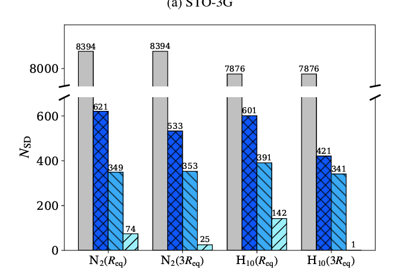&nbsp;&nbsp;&nbsp;&nbsp;
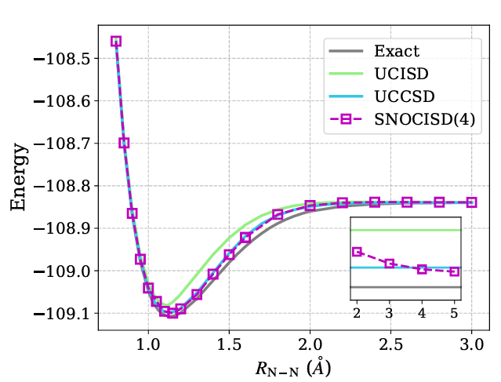

### Waveflow: boundary-conditioned normalizing flows applied to fermionic wavefunctions ([Link](https://pubs.aip.org/aip/aml/article/2/4/046106/3319478/Waveflow-Boundary-conditioned-normalizing-flows9))

L. Thiede, **C. Sun** (Co-first Author, Corresponding Author), A. Aspuru-Guzik. *APL Mach. Learn.* 2, 046106 (2024)

 In this work, we introduced Waveflow, an innovative framework for learning many-body fermionic wavefunctions using boundary-conditioned normalizing flows. Instead of relying on Slater determinants, Waveflow imposes antisymmetry by defining the fundamental domain of the wavefunction and applying necessary boundary conditions.
 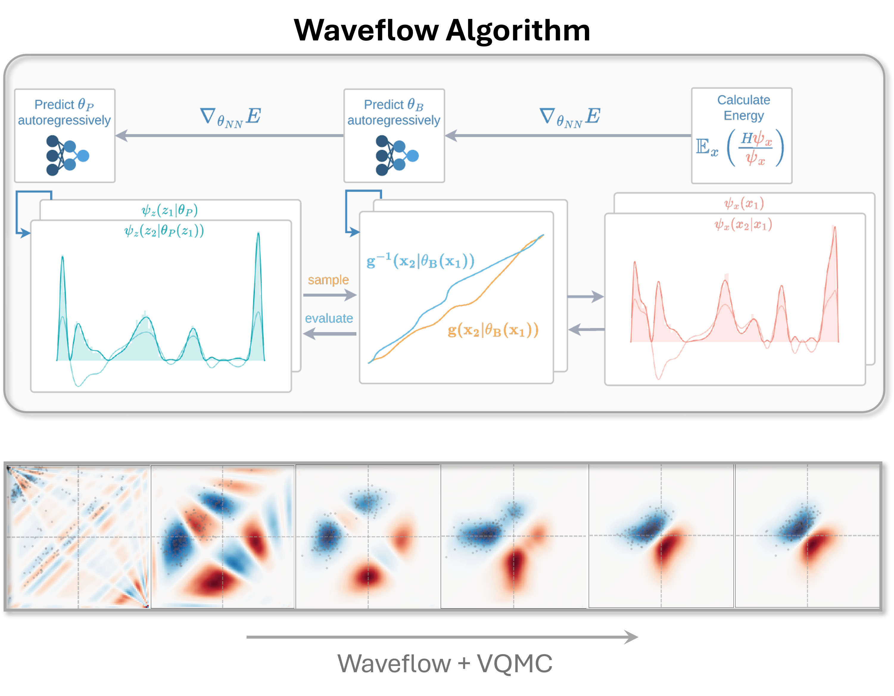

### Electron localization in disordered quantum systems at finite temperatures ([Arxiv](https://arxiv.org/abs/2403.16868))

**Chong Sun**, arXiv:2403.16868 [cond-mat.dis-nn]

We study electron localization in disordered quantum systems, focusing on both individual eigenstates and thermal states. We employ complex polarization as a numerical indicator to characterize the system's localization length. Furthermore, we assess the efficacy of mean-field approximation in providing a quantitative analysis of such systems. 

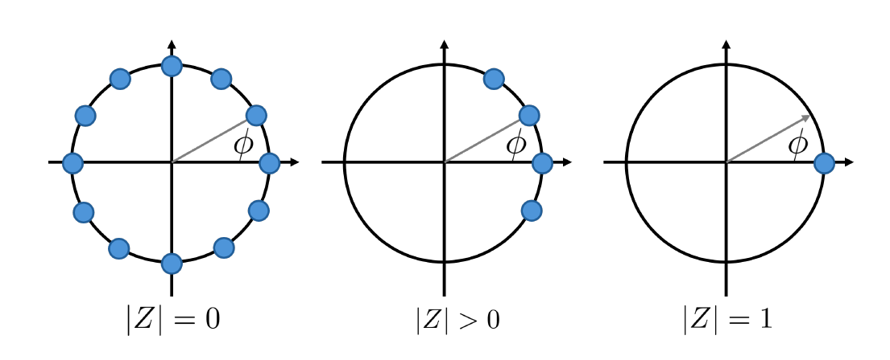&nbsp;&nbsp;&nbsp;&nbsp;
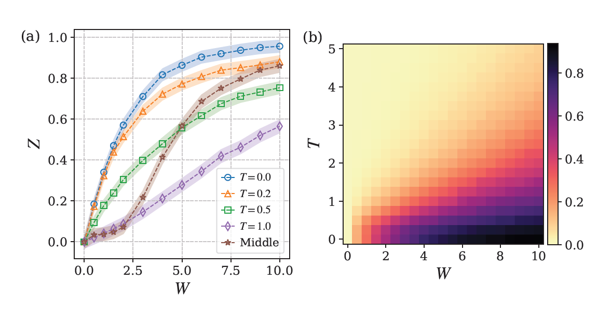

### Determining eigenstates and thermal states on a quantum computer using quantum imaginary time evolution ([Link](https://www.nature.com/articles/s41567-019-0704-4))

Mario Motta, **Chong Sun**, et. al., Nat. Phys. 16, 205–210 (2020).

This work provides a quantum algorithm for imaginary time evolution (ITE). The biggest
challenge of implementing ITE on a quantum computer is that the ITE operator is non-unitary. Unlike the popular block encoding approach, our algorithm does not require ancillary qubits. The key is to utilize the entanglement pattern of a physical system. 

  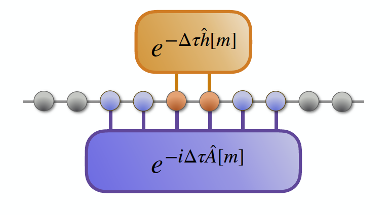&nbsp;&nbsp;&nbsp;&nbsp;
  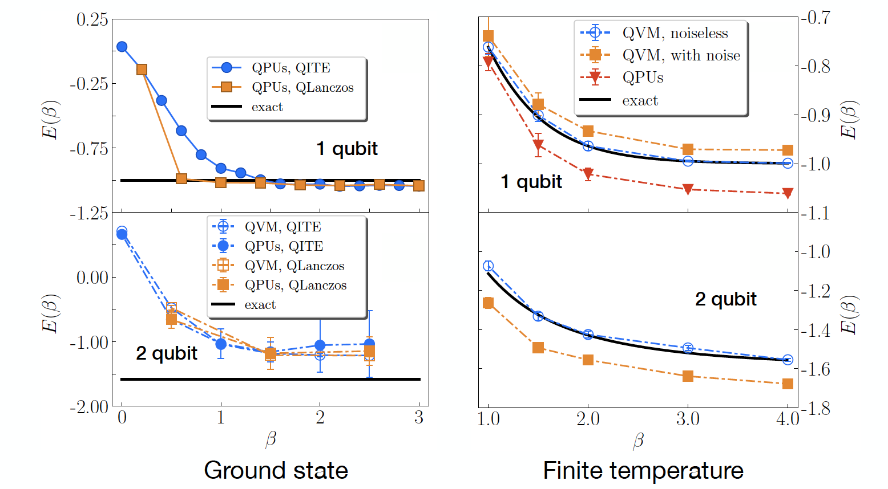

### Finite-temperature density matrix embedding theory ([Link](https://journals.aps.org/prb/abstract/10.1103/PhysRevB.101.075131))

**Chong Sun**, Ushnish Ray, Zhi-Hao Cui, Miles Stoudenmire, Michel Ferrero, and Garnet Kin-Lic Chan. Phys. Rev. B 101, 075131 (2020)

This paper provides a new vision on the behavior of entanglement at finite temperature. It also provides a numerical algorithm called finite-temperature density matrix embedding theory (FT-DMET), which is powerful for computing observables and phase diagrams for strongly correlated systems at finite temperature.

  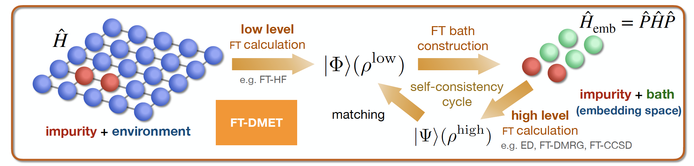&nbsp;&nbsp;&nbsp;&nbsp;
  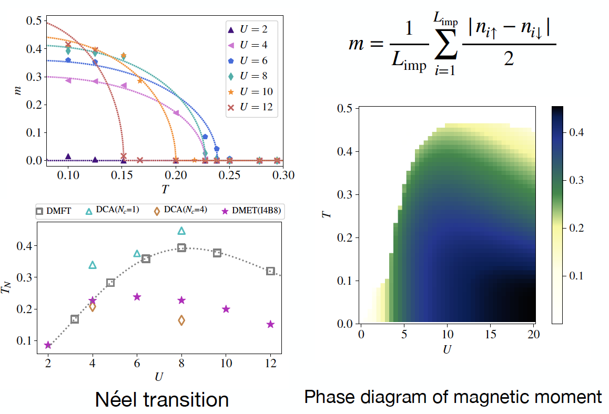

### Ground-state phase diagram of the three-band Hubbard model from density matrix embedding theory ([Link](https://journals.aps.org/prresearch/abstract/10.1103/PhysRevResearch.2.043259))

Zhi-Hao Cui, **Chong Sun**, et. al. Phys. Rev. Research 2, 043259(2020)

Three-band Hubbard model is a good model-approximation to the two-dimensional cuprate layer, which is the key structure of copper-based high-temperature superconductors. This paper applied density matrix embedding theory (DMET) to simulating the magnetic order and pairing parameters of the three-band Hubbard model with dopping, and shed light on understanding the mechanism of high Tc superconductors. 

  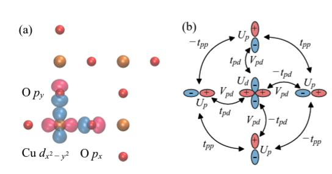&nbsp;&nbsp;&nbsp;&nbsp;
  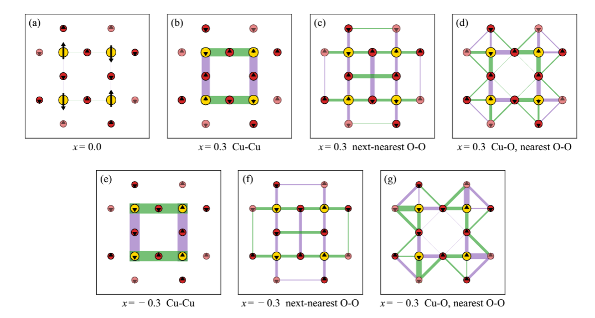

### Monte-Carlo simulations of spin-crossover phenomena based on a vibronic Ising-like model with realistic parameters ([Link](https://pubs.rsc.org/en/content/articlelanding/2015/cp/c4cp05562d/unauth))

Hong-Zhou Ye, **Chong Sun** (Co-first Author) and Hong Jiang, Phys. Chem. Chem. Phys.,17, 6801-6808 (2015)

<!-- Citation: <a href="../_publications/bibtexs/pccp2015.md"> bibtex style</a> -->

This work used realistic lattice parameters derived from density functional theory (DFT) simulations to study the spin crossover (SCO) behavior of the [Fe(pz)Pt(CN)4]·2H2O lattice. We simplified the complex lattice with an Ising-like model with elastic coupling between SCO centers. We profiled the thermal hysteresis of this SCO systems with Monte Carlo simulation. 

<!-- <figure> -->
  &nbsp;&nbsp;&nbsp;&nbsp;
  
  <!-- <figcaption>String and Ball model</figcaption> -->
<!-- </figure> -->