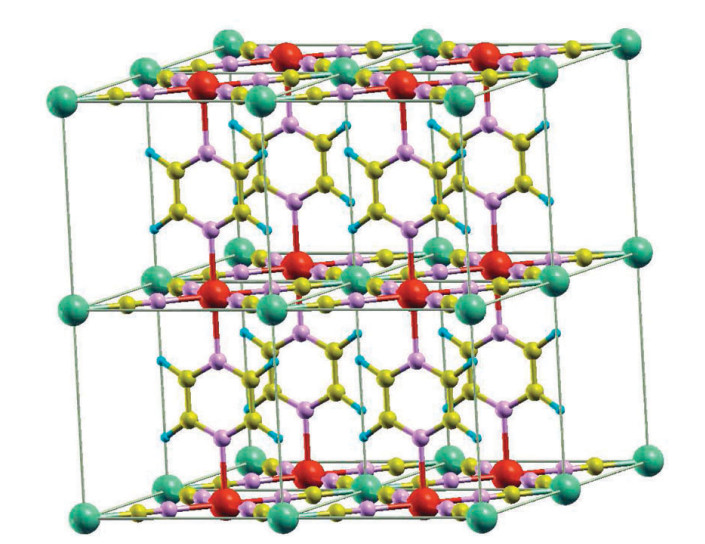
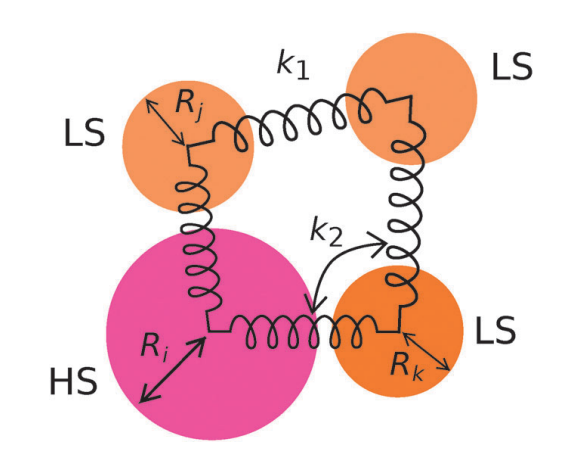

A full publication list can be found on my <u><a href="https://scholar.google.com/citations?user=KETTV4YAAAAJ&hl=en">Google Scholar</a>.</u>




  


## [Monte-Carlo simulations of spin-crossover phenomena based on a vibronic Ising-like model with realistic parameters](https://pubs.rsc.org/en/content/articlelanding/2015/cp/c4cp05562d/unauth)

Hong-Zhou Ye, Chong Sun and Hong Jiang (equal contribution), Phys. Chem. Chem. Phys., 2015,17, 6801-6808

This work used realistic lattice parameters derived from density functional theory (DFT) simulations to study the spin crossover (SCO) behavior of the [Fe(pz)Pt(CN)4]·2H2O lattice. We simplified the complex lattice with an Ising-like model with elastic coupling between SCO centers. We profiled the thermal hysteresis of this SCO systems with Monte Carlo simulation. 

<!-- <figure> -->
  &nbsp;&nbsp;&nbsp;&nbsp;
  
  <!-- <figcaption>String and Ball model</figcaption> -->
<!-- </figure> -->