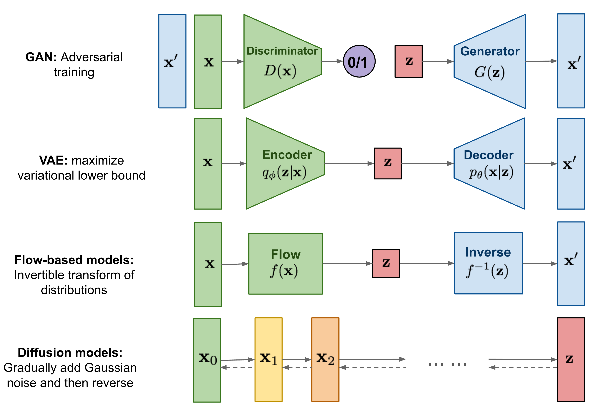

This post gives a general introduction of popular generative models such as variational autoencoder (VAE) and diffusion models (DM).

1. [Introduction](#introduction)
2. [Variational Autoencoder (VAE)](#variational-autoencoder-(VAE))
3. [Variational Diffusion Models (VDM)](#variational-diffusion-models (VDM))

# Introduction

The **goal** of a generative model is to learn the true data distribution $p(\mathbf{x})$ given a sample $\mathbf{x}$ from this distribution.

The **application** can be generating new samples from the approximated distribution.

Some popular generative models are summarized in the following table and the basic structures are shown in the figure following it.

| Class | Examples | Note |
| --- | --- | --- |
| Generative Adversarial Networks (GANs) |  | learned in an adversarial manner, difficult to train. |
| Likelihood-based models  | [Autoregressive models](https://arxiv.org/abs/1908.09257), Variational Autoencoders (VAEs) | optimization |
| Energy-based models |  | optimization |
| Score-based models | [Paper](https://arxiv.org/pdf/2208.11970.pdf) | optimization |

<figure>
  
  <figcaption>Overview</figcaption>
</figure>

### Philosophical discussion on the hierarchy of information

The data $\mathbf{x}$ we observe is usually represented or generated by a **latent** variable $\mathbf{z}$. This paper used the example of Plato's Allegory in Republican: The Cave. People in the cave can only see shadows on the wall they face, but the two-dimensional shadows are projections of three-dimensional objects.

In generative modeling, however, people try to learn lower-dimensional latent representations instead of higher-dimensional ones. My reasoning is 1) going from a low dimension to the high dimension it belongs to requires additional information; 2) most data human has is redundant and can be reduced to the important components. 

We can view the data we observe $\mathbf{x}$ and the latent variable $\mathbf{z}$ as correlated vectors, and the joint distribution is $p(\mathbf{x}, \mathbf{z})$. We know the sample distribution of our data $\mathbf{x}$, and we want to learn its *true distribution $p(\mathbf{x})$* that describes best our data $\mathbf{x}$. 

First we should notice there are two ways of deriving $p(\mathbf{x})$ from $p(\mathbf{x}, \mathbf{z})$:

- *Marginalizing out* the latent variable $\mathbf{z}$

$$
p(\mathbf{x}) = \int p(\mathbf{x}, \mathbf{z}) \mathrm{d}\mathbf{z}
$$

- Using the *chain rule of probability*

$$
p(\mathbf{x}) = \frac{p(\mathbf{x}, \mathbf{z})}{p(\mathbf{z}|\mathbf{x})} 
$$

Both approaches remove the information of $\mathbf{z}$. 

In the integration approach, the information is removed by the direction $\mathbf{z}\rightarrow \mathbf{x}$, i.e., for each $\mathbf{z}$ there is a distribution of $\mathbf{x}$, then summing up all $\mathbf{z}$ values will give the distribution of $\mathbf{x}$. 

In the chain rule approach, the information is removed by the direction  $\mathbf{x}\rightarrow \mathbf{z}$. Similar to the chain rule of derivation, we view $\mathbf{z}$ as a function of $\mathbf{x}$ through $p(\mathbf{z}\|\mathbf{x})$ , and $p(\mathbf{x}, \mathbf{z})$ a function of $\mathbf{x}$ and $\mathbf{z}$, then dividing $p(\mathbf{x}, \mathbf{z})$ by $p(\mathbf{z}\|\mathbf{x})$ will remove the information of $\mathbf{z}$ and result in the distribution of $\mathbf{x}$. 

## Evidence Lower Bound (ELBO)

The ELBO is the lower bound of the evidence, defined as the logarithm likelihood of the observed data $\log p(\mathbf{x})$, where the latter is hard to compute. 

In the **likelihood-based models**, we want to maximize the likelihood $p(\mathbf{x})$. Why? Because we want to make the model best describe the data we have, and if the probability of our $\mathbf{x}$ is small, then it meanx1s our model largely depends on the *unknown* data, and we this model will be bad to describe the known data $\mathbf{x}$.

We first give the expression of the ELBO, then prove that it is the lower bound of $\log p(\mathbf{x})$, which means ELBO is **variational**. The equation of ELBO is

$$
\mathbb{E}_{q_{\phi}(\mathbf{z}\|\mathbf{x})}\left[\log \frac{p(\mathbf{x}, \mathbf{z})}{q_{\phi}(\mathbf{z}\|\mathbf{x})}\right] \leq \log p(\mathbf{x})
$$

where $q_{\phi}(\mathbf{z}\|\mathbf{x})$ is an approximation to $p(\mathbf{z}\|\mathbf{x})$ with tunable parameters $\phi$. Next we prove that the above equation is indeed the lower bound of the log likelihood $\log p(\mathbf{x})$ from two perspectives: 

1) using [Jensen’s inequality](https://en.wikipedia.org/wiki/Jensen%27s_inequality) for convex and concave functions

$$
\log p(\mathbf{x}) = \log \int p(\mathbf{x}, \mathbf{z})\mathrm{d}\mathbf{z} = \log \int \frac{p(\mathbf{x}, \mathbf{z})q_{\phi}(\mathbf{z}|\mathbf{x})}{q_{\phi}(\mathbf{z}|\mathbf{x})}\mathrm{d}\mathbf{z} \\ = \log \mathbb{E}_{q_{\phi}(\mathbf{z}\|\mathbf{x})}\left[\frac{p(\mathbf{x}, \mathbf{z})}{q_{\phi}(\mathbf{z}|\mathbf{x})}\right] \geq \mathbb{E}_{q_{\phi}(\mathbf{z}|\mathbf{x})}\left[\log \frac{p(\mathbf{x}, \mathbf{z})}{q_{\phi}(\mathbf{z}\|\mathbf{x})}\right]
$$

where the $\geq$ sign used Jensen’s inequality since $\log$ is a concave function.

2) we can actually figure out the difference between the ELBO and the true log likelihood by

$$
\log p(\mathbf{x}) = \log p(\mathbf{x}) \underbrace{\int q_{\phi}(\mathbf{z}\|\mathbf{x})}_{=1} = \int q_{\phi}(\mathbf{z}\|\mathbf{x})(\log p(\mathbf{x}))\mathrm{d}\mathbf{z} \\ =\mathbb{E}_{q_{\phi}(\mathbf{z}\|\mathbf{x})}[\log p(\mathbf{x})] = \mathbb{E}_{q_{\phi}(\mathbf{z}\|\mathbf{x})}\left[\log \frac{p(\mathbf{x}, \mathbf{z})}{p(\mathbf{z}|\mathbf{x})}\right]  = \mathbb{E}_{q_{\phi}(\mathbf{z}|\mathbf{x})}\left[\log \frac{p(\mathbf{x}, \mathbf{z})q_{\phi}(\mathbf{z}|\mathbf{x})}{p(\mathbf{z}|\mathbf{x})q_{\phi}(\mathbf{z}|\mathbf{x})}\right]\\ = \mathbb{E}_{q_{\phi}(\mathbf{z}|\mathbf{x})}\left[\log \frac{p(\mathbf{x}, \mathbf{z})}{q_{\phi}(\mathbf{z}|\mathbf{x})}\right] + \mathbb{E}_{q_{\phi}(\mathbf{z}|\mathbf{x})}\left[\log \frac{q_{\phi}(\mathbf{z}|\mathbf{x})}{p(\mathbf{z}|\mathbf{x})}\right]\\ = \mathrm{ELBO} + D_{\mathrm{KL}}(q_{\phi}(\mathbf{z}|\mathbf{x}) || p(\mathbf{z}|\mathbf{x})) \geq  \mathrm{ELBO}
$$

where $D_{\mathrm{KL}}(q_{\phi}(\mathbf{z}\|\mathbf{x}) \|\| p(\mathbf{z}\|\mathbf{x}))$ is the *Kullback-Leibler divergence (or KL divergence or **relative entropy**)* between $q_{\phi}(\mathbf{z}\|\mathbf{x})$ and $p(\mathbf{z}\|\mathbf{x})$, and is always $\geq 0$, due to the [*Gibbs inequality*](https://en.wikipedia.org/wiki/Gibbs%27_inequality): the entropy of a probability distribution $-q\log q$  is always greater than or equal to the cross entropy $-q\log p$.  

Therefore we figured out that the difference between the ELBO and the log likelihood is the KL-divergence of the conditional probability $p(\mathbf{z}\|\mathbf{x})$ and the approximated one $q_{\phi}(\mathbf{z}\|\mathbf{x})$.

# Variational Autoencoder (VAE)

***Variational*** comes from the ELBO is the lower bound of the log likelihood, so the method is variational. ***Autoencoder*** comes from a traditional autoencoder model, where input data is trained to predict itself after undergoing an intermediate bottlenecking representation step. The idea (left) and the network (right) of are shown as follows. The **bottleneck representation** is the red layer, i.e., the **latent data**, and it looks like the shape of a bottleneck.

The encoder is $q(\mathbf{z}\|\mathbf{x})$, and the decoder is $p(\mathbf{x}\|\mathbf{z})$.

Practically,  $p(\mathbf{x}\|\mathbf{z})$ is what we want to know (because then we can get $p(\mathbf{x})$ with chain rule; while $q(\mathbf{z}\|\mathbf{x})$ is intractable to calculate. Therefore, in the following, we assign parameters to them: $p(\mathbf{x})\rightarrow p_\theta(\mathbf{x})$, $q(\mathbf{z}\|\mathbf{x})\rightarrow q_\phi(\mathbf{z}\|\mathbf{x})$, and our goal is to optimize the parameters $\theta$ and $\phi$ in order to maximize the likelihood.

### Rewriting the ELBO

Next we want to rewrite the expression of $p_\theta(\mathbf{x})$ to explicitly contain the encoder $q_\phi(\mathbf{z}\|\mathbf{x})$ and the decoder $p_\theta(\mathbf{x}\|\mathbf{z})$. 

Following the second expression of the ELBO, we have

$$
p_\theta(\mathbf{x}) = \mathrm{ELBO} + D_{\mathrm{KL}}(q_{\phi}(\mathbf{z}\|\mathbf{x}) \|\| p_\theta(\mathbf{z}|\mathbf{x}))\\ = \mathbb{E}_{q_{\phi}(\mathbf{z}|\mathbf{x})}\left[\log \frac{p_\theta(\mathbf{x}, \mathbf{z})}{q_{\phi}(\mathbf{z}|\mathbf{x})}\right] + D_{\mathrm{KL}}(q_{\phi}(\mathbf{z}|\mathbf{x}) || p_\theta(\mathbf{z}|\mathbf{x}))
$$

The ELBO can be further written as

$$
\mathbb{E}_{q_{\phi}(\mathbf{z}|\mathbf{x})}\left[\log \frac{p_\theta(\mathbf{x}, \mathbf{z})}{q_{\phi}(\mathbf{z}|\mathbf{x})}\right] = \mathbb{E}_{q_{\phi}(\mathbf{z}|\mathbf{x})}\left[\log \frac{p_\theta(\mathbf{x}| \mathbf{z})p(\mathbf{z})}{q_{\phi}(\mathbf{z}|\mathbf{x})}\right]\\ = \mathbb{E}_{q_{\phi}(\mathbf{z}|\mathbf{x})}\left[\log p_\theta(\mathbf{x}| \mathbf{z})\right] + \mathbb{E}_{q_{\phi}(\mathbf{z}|\mathbf{x})}\left[\log \frac{p(\mathbf{z})}{q_{\phi}(\mathbf{z}|\mathbf{x})}\right] \\ = \mathbb{E}_{q_{\phi}(\mathbf{z}|\mathbf{x})}\left[\log p_\theta(\mathbf{x}| \mathbf{z})\right]  - D_{\mathrm{KL}}(q_\phi(\mathbf{z}|\mathbf{x})|| p(\mathbf{z}))
$$

Therefore, the expression of $p_\theta(\mathbf{x})$ is 

$$
p_\theta(\mathbf{x}) = \mathbb{E}_{q_{\phi}(\mathbf{z}|\mathbf{x})}\left[\log p_\theta(\mathbf{x}| \mathbf{z})\right] - D_{\mathrm{KL}}[q_\phi(\mathbf{z}|\mathbf{x})|| p(\mathbf{z})] + D_{\mathrm{KL}}[q_{\phi}(\mathbf{z}|\mathbf{x}) || p_\theta(\mathbf{z}|\mathbf{x})] \\ \geq \underbrace{\mathbb{E}_{q_{\phi}(\mathbf{z}|\mathbf{x})}\left[\log p_\theta(\mathbf{x}| \mathbf{z})\right]}_{\mathrm{reconstruction\ term}} - \underbrace{D_{\mathrm{KL}}[q_\phi(\mathbf{z}|\mathbf{x})|| p(\mathbf{z})]}_{\mathrm{prior\ matching\ term}} = \mathrm{ELBO}
$$

Computing $D_{\mathrm{KL}}[q_{\phi}(\mathbf{z}\|\mathbf{x}) \|\| p_\theta(\mathbf{z}\|\mathbf{x})]$  is intractable, since it involves the conditional probability distributions, but we know it is non-negative, therefore we only need to evaluate the ELBO, which further consists of two terms: the **reconstruction term** and the **prior matching term**. 

In order to maximize the ELBO, we want to maximize the **reconstruction term** and minimize the **prior matching term**. 

$$
\max_{\phi,\theta}\left(\mathbb{E}_{q_{\phi}(\mathbf{z}|\mathbf{x})}\left[\log p_\theta(\mathbf{x}| \mathbf{z})\right]  - D_{\mathrm{KL}}(q_\phi(\mathbf{z}|\mathbf{x})|| p(\mathbf{z}))\right)
$$

### The prior matching term

Let’s look at the second term, minimizing the KL divergence of $q_\phi(\mathbf{z}\|\mathbf{x})$   and $p(\mathbf{z})$ means to make them as similar as possible. $p(\mathbf{z})$ is a prior distribution of the latent variables that we choose in advance. It is easy to see that the choice of $p(\mathbf{z})$ does not constrain the expressions of $p(\mathbf{x})$, so theoretically we can choose any $p(\mathbf{z})$. However, we choose $p(\mathbf{z})$ to be a **standard multivariate Gaussian** 

$$
p(\mathbf{z}) = \mathcal{N}(\mathbf{z}; \mathbf{0}, \mathbf{I})
$$

The **general form of a multivariate Gaussian** with $n$ variables is 

$$
\mathcal{N}(\mathbf{z}; \mathbf{\mu}, \mathbf{\Sigma}) = \frac{1}{\sqrt{(2\pi)^{n}\det [\mathbf{\Sigma}]}} \exp\left[-\frac{1}{2}(\mathbf{z} - \mathbf{\mu})^T \mathbf{\Sigma}^{-1}(\mathbf{x}-\mathbf{\mu})\right]
$$

where $\mathbf{\mu}$ is the mean of $\mathbf{z}$, and $\mathbf{\Sigma}$ is the $n\times n$ covariance matrix: $\Sigma_{ij} = \mathbb{E}[(z_i-\mu_i)(z_j - \mu_j)]$.

Then the encoder $q_\phi(\mathbf{z}\|\mathbf{x})$ is commonly chosen to be a multivariant Gaussian with diagonal variance

$$
q_\phi(\mathbf{z}|\mathbf{x}) = \mathcal{N}(\mathbf{z}; \mathbf{\mu}_{\phi}(\mathbf{x}), \mathbf{\sigma}^2_\phi(\mathbf{x})\mathbf{I})
$$

Then the KL divergence $D_{\mathrm{KL}}[q_\phi(\mathbf{z}\|\mathbf{x})\|\| p(\mathbf{z})]$ can be computed analytically.

### The reconstruction term

This term ensures that the learned distribution is modeling effective latent data that the original data can be regenerated from. This term can be evaluated using Monte Carlo sampling:

$$
\mathbb{E}_{q_{\phi}(\mathbf{z}|\mathbf{x})}\left[\log p_\theta(\mathbf{x}| \mathbf{z})\right] \approx \sum_{l=1}^L \log p_\theta(\mathbf{x}| {z}^{(l)})
$$

where the latents $z^{(l)}_{l=1}^L$ are sampled from  $q_\phi(\mathbf{z}\|\mathbf{x})$ for *every* ${x}$ in the dataset. 

If we directly generate a layer of $\mathbf{z}$ values from $q_\phi(\mathbf{z}\|\mathbf{x})$, then since $\{z^{(l)}\}_{l=1}^L$ are generated stochastically, the gradient with respect to $\phi$ cannot be evaluated easily. This can be resolved by **reparameterization**. The idea is to move the stochastic node out of the network, as follows (lecture slide from MIT).

The reparameterization trick rewrites a random variable as *a deterministic function of a noise variable* (i.e. another random variable). For example, sampling from a normal distribution $x\sim \mathcal{N}(x;\mu, \sigma^2)$ with arbitrary $\mu$ and $\sigma$ can be derived from a standard normal distribution of an auxiliary **noise variable** $\epsilon \sim \mathcal{N}(\epsilon;0, 1)$  from

$$
x = \mu + \sigma \epsilon, \mathrm{\ with \ } \epsilon \sim \mathcal{N}(\epsilon;0, 1) 
$$

where we shifted the mean of $\epsilon$ by $\mu$ and stretched the variance of $\epsilon$ by $\sigma^2$.  Thus each $\mathbf{z}^{(l)}$ can be computed by

$$
\mathbf{z}^{(l)} = \mathbf{\mu}_\phi(\mathbf{x}) + \mathbf{\sigma}_\phi(\mathbf{x})\cdot \mathbf{\epsilon}^{(l)}
$$

where $\mathbf{\epsilon}^{(l)} \sim \mathcal{N}(\mathbf{\epsilon}; \mathbf{0}, \mathbf{I})$. 

Next, we can generate new data $\mathbf{x}$ from $\mathbf{z}^{(l)}$ by the decoder. VAE likes the dimension of $\mathbf{z}$ to be smaller than the dimension of $\mathbf{x}$.

The algorithm is shown as follows (lecture slides from Stanford):

An example code of VAE is [here](https://github.com/pytorch/examples/blob/main/vae/main.py#L47-L73).

### Hierarchical VAE (HVAE)

The idea of Hierarchical VAE is straightforward: instead of one layer of latent variables, multiple layers of latent variables are used, as follows

The chain rule for Markovian HVAE is

$$
p_\theta(\mathbf{x},\mathbf{z}_{1:T}) = p_\theta(\mathbf{x}|\mathbf{z}_1)\left(\prod_{t=2}^T p_\theta(\mathbf{z}_{t-1}|\mathbf{z}_t)\right)p(\mathbf{z}_T),\\ q_\phi(\mathbf{z}_{1:T}|\mathbf{x}) = \left(\prod_{t=2}^T q_\phi(\mathbf{z}_t|\mathbf{z}_t)\right)q_\phi(\mathbf{z}_1|\mathbf{x})
$$

And the ELBO is

$$
\log p_\theta(\mathbf{x}) \geq \mathbb{E}_{q_\phi(\mathbf{z}_{1:T}|\mathbf{x})}\left[\log\frac{p_\theta(\mathbf{x},\mathbf{z}_{1:T})}{q_\phi(\mathbf{z}_{1:T}|\mathbf{x})}\right]
$$

# Variational Diffusion Models (VDM)

VDM has the same structure as the Markovian Hierarchical VAE, with three constraints:

- There is no bottleneck, i.e. the latent dimension equal to the data dimension.
- The latent encoder is a Gaussian distribution centered around the output of the previous step.
- The Gaussian parameters are tuned so that the final latent variables is a standard Gaussian.

The idea is to evolve the data to a pure Gaussian noise, and the information of the distribution of the data is encoded in the hyperparameters in each layer. This is a coarse-graining procedure, similar as tensor network contraction. Shown in the following figure:

## The model

We can take each layer as a time step $t$, and the latent variables are $\mathbf{x}_t$. $\mathbf{x}_0$ is our data, while $\mathbf{x}_T$ is the last latent variables following the *standard Gaussian*. The chain rule becomes

$$
q(\mathbf{x}_{1:T}|\mathbf{x}_0) = \prod_{t=1}^T q(\mathbf{x}_t|\mathbf{x}_{t-1})
$$

At time $t$, the distribution of $\mathbf{x}_t$ is the Gaussian around $\mathbf{x}_{t-1}$

$$
q(\mathbf{x}_{t}|\mathbf{x}_{t-1}) = \mathcal{N}(\mathbf{x}_t;\sqrt{\alpha_t}\mathbf{x}_{t-1}, (1-\alpha_t)\mathbf{I})
$$

where $\alpha_t$ is the parameter we choose at time $t$ to ensure $\mathbf{x}_T$ is standard Gaussian. Note that the encoding process is *variance-preserving*, since the scaling of $\alpha_t$ shows both on the denominator and the numeritor. 

The opposite direction, going from time $T$ to time $0$, we have

$$
p(\mathbf{x}_T) = \mathcal{N}(\mathbf{x}_T; \mathbf{0}, \mathbf{I})\\ p_{\theta}(\mathbf{x}_{0:T}) = p(\mathbf{x}_T)\prod_{t=1}^T p_{\theta}(\mathbf{x}_{t-1}|\mathbf{x}_{t})
$$

where only $p(\mathbf{x}_T)$ has a fixed expression.

Since $q(\mathbf{x} \| \mathbf{x}_{t-1})$ is pre-chosen, we only need to learn the backward conditions $p_{\theta}(\mathbf{x}_{t-1} \| \mathbf{x}_t)$, i.e., the parameters $\theta$.

### Generating new data

Once $p_{\theta}(\mathbf{x}_{t-1} \| \mathbf{x}_t)$ are learned, one can start from a standard Gaussian, and iteratively run the denoising transitions $p_{\theta}(\mathbf{x}_{t-1} \| \mathbf{x}_t)$ for $T$ steps to generate new data $\mathbf{x}_0$.

### ELBO

We skip the derivation of the ELBO for VDM, but write down the final equation. One can find the derivations in Page 9-10 in the [paper](https://arxiv.org/abs/2208.11970) by Kavin Luo.

$$
\log p(\mathbf{x}) \geq \underbrace{\mathbb{E}_{q(\mathbf{x}_1|\mathbf{x}_0)}[\log p_{\theta(\mathbf{x}_1|\mathbf{x}_0)}]}_{\text{reconstruction term}} - \underbrace{D_{\text{KL}}(q(\mathbf{x}_T|\mathbf{x}_0)|| p(\mathbf{x}_T))}_{\text{prior matching term}} \\
- \underbrace{\sum_{t=2}^T \mathbb{E}_{q(\mathbf{x}_t|\mathbf{x}_0)}[D_{\text{KL}}(q(\mathbf{x}_{t-1}|\mathbf{x}_t,\mathbf{x}_0))||p_{\theta}(\mathbf{x}_{t-1}|\mathbf{x}_t)]}_{\text{denoising matching term}}
$$

The three terms correspond to

- The reconstruction term $\mathbb{E}_{q(\mathbf{x}_1 \| \mathbf{x}_0)}[\log p_{\theta}(\mathbf{x}_0\|\mathbf{x}_1)]$ can be approximated and optimized using Monte Carlo.

- The prior matching term $D_{\text{KL}}(q(\mathbf{x}_T \| \mathbf{x}_0) \|\|  p(\mathbf{x}_T))$ is how close the final distribution to a standard Gaussian, and has no trainable parameters, so we can take is as a constant, say zero, and ignore it.

- The denoising matching term $\sum_{t=2}^T \mathbb{E}_{q(\mathbf{x}_t \| \mathbf{x}_0)}[D_{\text{KL}}(q(\mathbf{x}_{t-1} \| \mathbf{x}_t,\mathbf{x}_0)) \|\| p_{\theta}(\mathbf{x}_{t-1} \| \mathbf{x}_t)]$ , going in the reverse time direction. The ground truth denoising transition step is $q(\mathbf{x}_{t-1} \| \mathbf{x}_t, \mathbf{x}_0)$, and we train the parameters $\theta$ to learn $p_{\theta}(\mathbf{x}_{t-1} \| \mathbf{x}_t)$.
