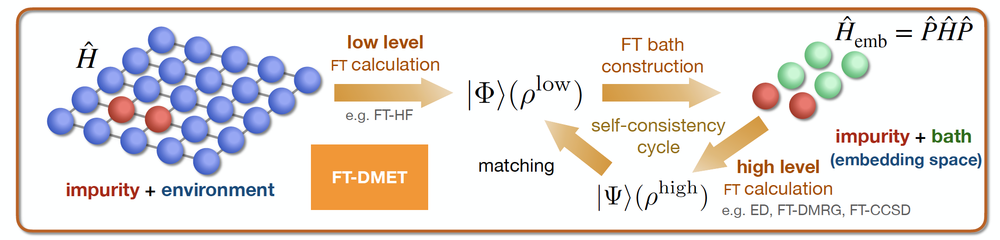
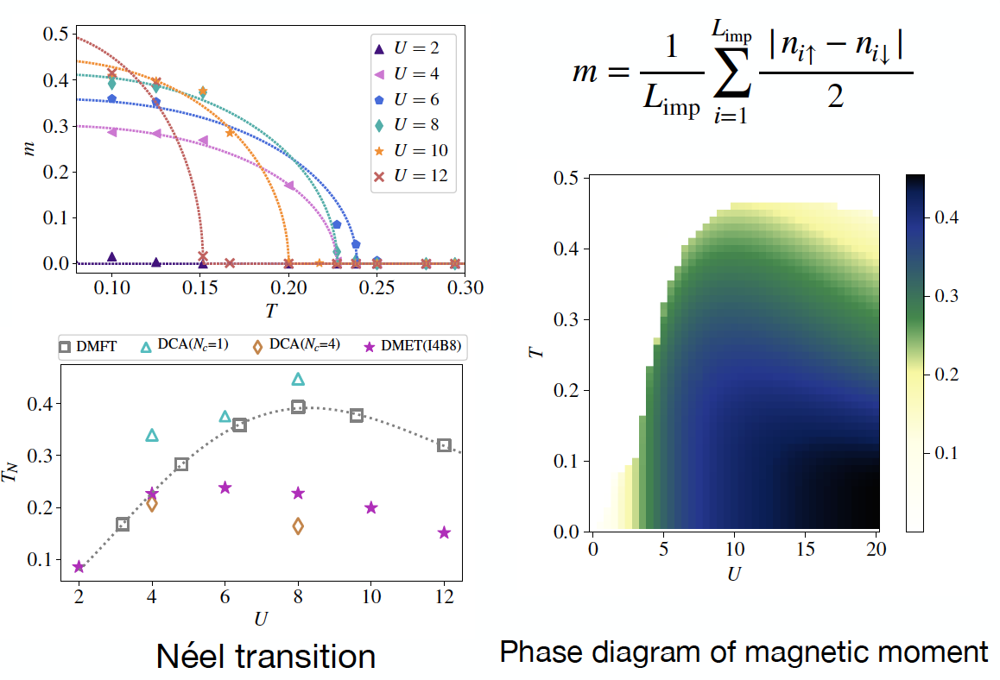

This paper provides a new vision on the behavior of entanglement at finite temperature. It also
provides a numerical algorithm called finite-temperature density matrix embedding theory (FT-DMET), which is powerful for computing observables and phase diagrams for strongly correlated systems at finite temperature.
<!-- 

 -->
<figure>
  
  <figcaption>FT-DMET Algorithm</figcaption>
</figure>
<figure>
  
  <figcaption>Neel transition of 2D Hubbard model</figcaption>
</figure>