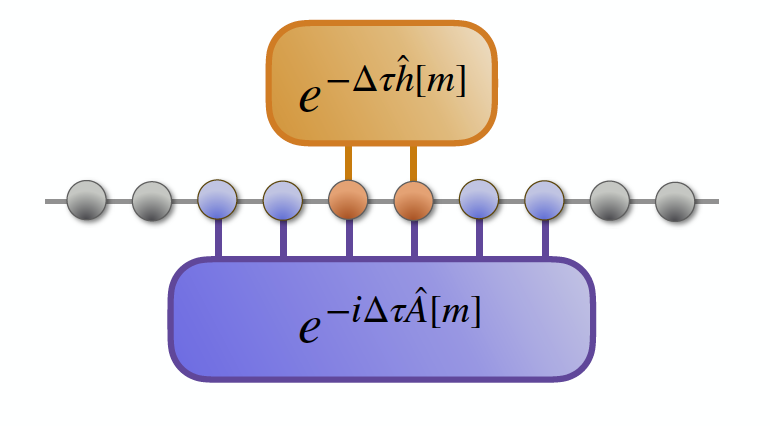
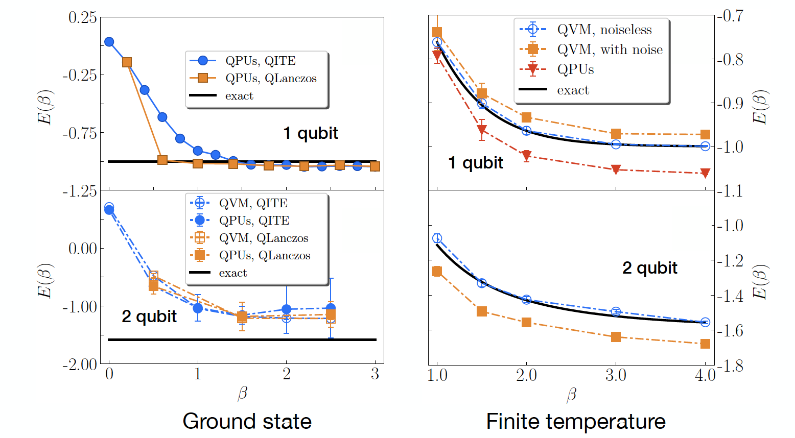

This paper provides a quantum algorithm for imaginary time evolution (ITE). The biggest
challenge of implementing ITE on a quantum computer is that the ITE operator is non-unitary. Unlike the popular block encoding approach, our algorithm does not require ancillary qubits. The key is to utilize the entanglement pattern of a physical system. 

<figure>
  
  <figcaption>Spread of entanglement</figcaption>
</figure>

<figure>
  
  <figcaption>QPU simulations</figcaption>
</figure>