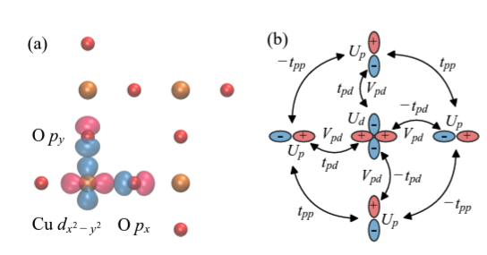
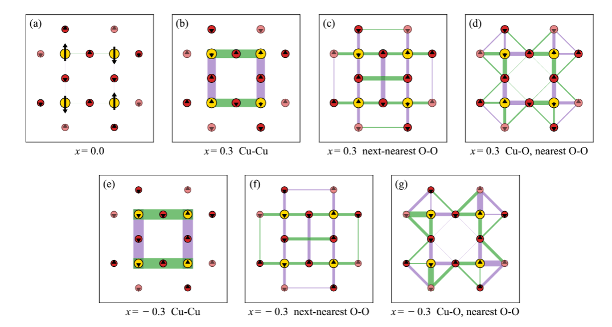

Three-band Hubbard model is a good model-approximation to the two-dimensional cuprate layer, which is the key structure of copper-based high-temperature superconductors. This paper applied density matrix embedding theory (DMET) to simulating the magnetic order and pairing parameters of the three-band Hubbard model with dopping, and shed light on understanding the mechanism of
high Tc superconductors. 

<figure>
  
  <figcaption>Three-band Hubbard model</figcaption>
</figure>

<figure>
  
  <figcaption>Charge, spin and pairing parameters.</figcaption>
</figure>
